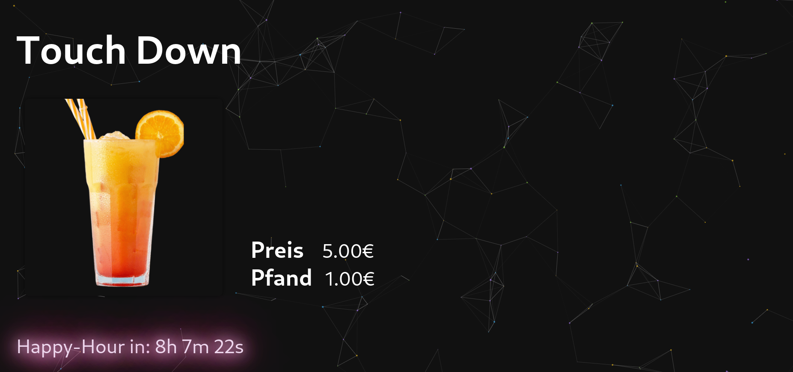
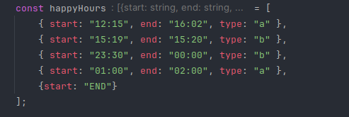
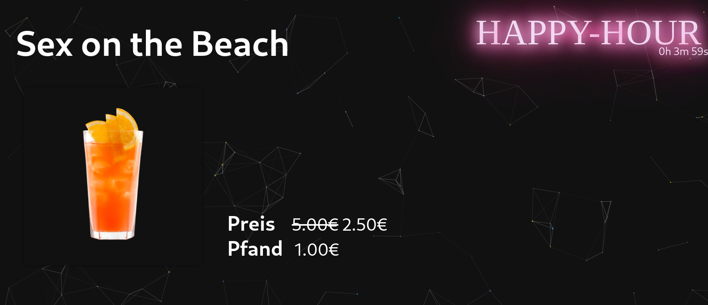
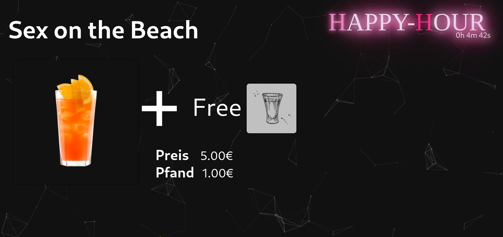

<!-- PROJECT LOGO -->
 

    

<h3 align="center">BarSliders</h3>

  

   Animated/Styled Price list for Bars and Clubs displayed on Screen      
    
  

<!-- ABOUT THE Project -->
## About The Project
Html & Css styled Project for Bars/Clubs displays. Features interactive happy hours (Type A and Type B).   
Both happy hour types can be custom set on specific times. 

Used from:
- https://www.kjg-st-norbert.de/

<!-- Setup -->
## Setup
- open the `main.html` file on your favourite browser. Press `F11` or `Left-click` to go in Full-screen. 
- config your happy hours in the `script.js` file like this: 

- refresh website 

<!-- Function -->
## Function
- Slides default drink 
- Animated background 
- Animated Neon-Countdowns   
- HappyHour interface 

 Typ A (50% off)

 Typ B (+ 1 Free shot)
 

<!-- Todo -->
## Todo
- ConfigFile-System
- ContentManagement System
- HappyHour after 12 p.m.